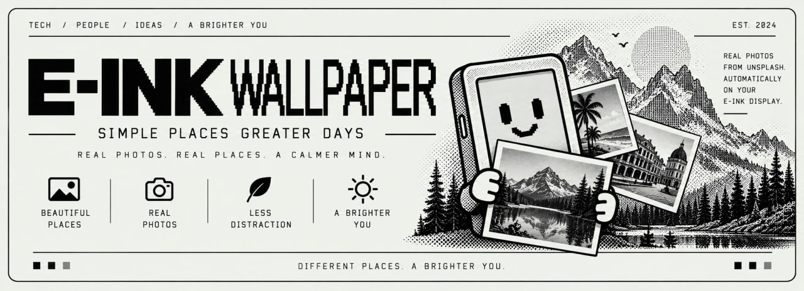

<p align="center">
  
</p>

<h1 align="center">E-INK WALLPAPER</h1>

<p align="center">
  <strong>A new Unsplash photo every minute on a Kindle e-ink panel.</strong><br />
  Cached locally, grayscale, and tap-to-exit.
</p>

<p align="center">
  
  
  
  <a href="LICENSE"></a>
</p>

<p align="center">
  <a href="#on-the-kindle">On the Kindle</a>
  ·
  <a href="#unsplash-feed">Unsplash feed</a>
  ·
  <a href="#settings">Settings</a>
  ·
  <a href="#testing-on-the-pc">Testing</a>
</p>

---

## On the Kindle

A plain POSIX `sh` scriptlet for a jailbroken Kindle. It keeps the e-ink panel
awake, displays a new Unsplash photo every 60 seconds, prefetches the next
photo, and returns to the library when you tap the screen.

It is an always-on photo frame while the scriptlet is running. It is not a
replacement for the Kindle's sleep-screen image files.

## What it does

1. Fetches a feed of up to 30 photos.
2. Extracts the `images.unsplash.com` photo URLs without requiring `jq`.
3. Requests a panel-sized, cropped, grayscale image from Unsplash's imgix CDN.
4. Displays it with FBInk and prefetches the next image.
5. Keeps cached images for offline playback and prunes old files.
6. Waits one minute or a tap, then advances or exits to the library.

The default image request is a grayscale JPEG at the panel size. FBInk's image
loader supports JPEG and PNG; JPEG is substantially smaller over Kindle Wi-Fi.
Set `IMAGE_PARAMS` to `fit=crop&crop=entropy&fm=png8&q=80&sat=-100&con=10`
if the device's FBInk build is known to prefer PNG.

## Unsplash feed

The default query is:

```text
nature animals abstract
```

The script URL-encodes that query and searches for images matching those
themes. Set `UNSPLASH_QUERY` in `unsplash.conf` to customize it.

Without a key, the script uses Unsplash's public search JSON endpoint. This is
the zero-setup path and is best-effort because it is not the documented API
contract.

For the documented API, put a free Unsplash API key in `unsplash.conf`:

```sh
UNSPLASH_ACCESS_KEY=your-client-id
```

The keyed path requests:

```text
https://api.unsplash.com/search/photos?query=nature%20animals%20abstract&per_page=30
```

`UNSPLASH_FEED_URL` can override either feed with a JSON endpoint that returns
photo objects containing `urls.raw` or another `images.unsplash.com` URL.

If photos are redistributed outside the personal device, follow Unsplash's
current API attribution and hotlinking requirements. The script keeps the
returned CDN URLs rather than copying image assets into the repository.

## Install

1. Copy `eink-wallpaper.sh` and `eink-wallpaper.jpg` to `/mnt/us/documents/`.
2. Optionally copy `eink-wallpaper.png` as a PNG sidecar cover.
3. Create `/mnt/us/documents/eink-wallpaper/unsplash.conf` from
   `unsplash.conf.example` if you need a key or non-default settings.
4. Eject the Kindle safely and open **E-INK WALLPAPER** from the library.
5. Tap the screen to return to the library.

The script uses `/mnt/us/documents/eink-wallpaper/` for its feed, cache and log.
The default cache is limited to 40 recently shown images.

## Settings

| Setting | Default | Purpose |
|---|---:|---|
| `INTERVAL` | `60` | Seconds each image remains visible. `0` is useful for smoke tests. |
| `PANEL` | `600x800` | Width and height requested from Unsplash. |
| `PER_PAGE` | `30` | Photos fetched per feed cycle. |
| `UNSPLASH_QUERY` | `nature animals abstract` | Search terms used for the wallpaper feed. |
| `KEEP` | `40` | Maximum cached image files. |
| `IMAGE_PARAMS` | grayscale JPEG | Imgix crop, format and quality parameters. |
| `FBINK_IMAGE_ARGS` | centered | Extra FBInk image options; add `,dither` for banding. |
| `MAX_RUN` | `0` | Stop after this many displayed images; `0` means unlimited. |
| `ERROR_WAIT` | `120` | Seconds to show a no-network message before exiting. |
| `TOUCH_DEV` | auto | Explicit evdev path when touch detection needs help. |

Environment variables and `unsplash.conf` use the same names. The config file
is sourced as shell, so quote values containing `&`, `?`, or spaces and do not
put untrusted content there.

## Testing on the PC

The suite uses a local feed fixture and stubs for curl, FBInk and Lipc. It does
not contact Unsplash or need a Kindle:

```sh
sh tests/smoke.sh
```

The suite covers feed parsing, premium-host filtering, rotation, atomic image
caching, offline playback, API-key headers, tap exit, `preventScreenSaver`,
and cache pruning.

For a syntax and metadata check from the repository root:

```sh
sh dev-tools/check.sh eink-wallpaper
```

## Troubleshooting

| Symptom | Likely cause | Fix |
|---|---|---|
| Returns to the library immediately | The process exited | Check `unsplash.log`; the script must stay alive. |
| `Could not reach Unsplash` | No HTTPS fetcher or Wi-Fi/DNS failure | Check `curl`/`wget`, Wi-Fi, and the log. |
| Same image repeats | Feed or CDN unavailable | Cached images are intentional; restore network access. |
| Screen blanks | Power daemon won the race | Lower `INTERVAL`; confirm `preventScreenSaver` in the log path. |
| Tap does not exit | Wrong evdev device | Inspect `/proc/bus/input/devices`, then set `TOUCH_DEV`. |
| Image is missing | FBInk path or image support is unavailable | Check `/mnt/us/libkh/bin/fbink`; run the smoke suite and test `fbink -g`. |

## License

MIT. See [LICENSE](LICENSE).
